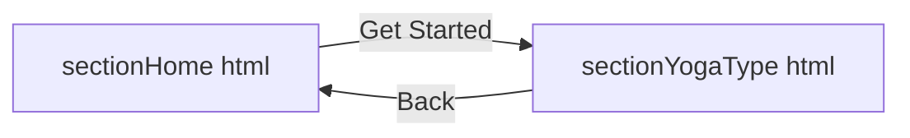

# sectionHome.html

This file serves as the **landing section** of the Yoga Experience Platform. It introduces users to the app’s purpose and provides a clear call-to-action to explore different yoga types.

## Purpose
- Display a welcoming message and hero image.  
- Highlight the core benefit of yoga poses.  
- Guide users to the next section via a **Get Started** button.

## Structure Overview
- HTML5 document with Bootstrap and custom CSS/JS.  
- Three main parts: header links, body content, and footer scripts.

## Key Elements
| Element                         | Type      | Description                                           |
|---------------------------------|-----------|-------------------------------------------------------|
| `<link href="sectionHome.css">` | Stylesheet| Custom styles for background, text, and button.       |
| `<h1 class="yoga-main-heading">`| Heading   | Main title with a line break for emphasis.            |
| `` | Image     | Hero illustration of a yoga practitioner.             |
| `<p class="yoga-description">`  | Paragraph | Brief description of yoga benefits.                   |
| `<a class="yoga-button">`       | Button    | Links to **sectionYogaType.html** to explore options. |

```html
<div class="yoga-bg-container">
  <h1 class="yoga-main-heading">
    Discover the yogi life on the<br/>Yoga Experience Platform
  </h1>
  <div class="d-flex flex-column justify-content-center">
    
  </div>
  <div class="yoga-bottom-part">
    <p class="yoga-description">
      Yoga poses strengthen and open tight areas of<br/>the body.
    </p>
    <a href="sectionYogaType.html" class="yoga-button">Get Started</a>
  </div>
</div>
```

## Styling & Scripts
- **Bootstrap 4.5.2** for responsive layout and utility classes.  
- **sectionHome.css** handles background, typography, and button theme.  
- External JS (jQuery, Popper, Bootstrap) loaded in `<head>`; CCBP UI kit at end of `<body>` for interactive UI components.

## Related Sections 🔗
- Links to **sectionYogaType.html** for yoga categories.  
- Shares the same UI kit script with Section Yoga Type.

---

# sectionYogaType.html

This page presents a catalog of popular yoga styles. Users can learn about each type and navigate back to the home section.

## Purpose
- Showcase four yoga types with images and descriptions.  
- Offer a **Back** button to return to the home view.  
- Maintain consistent styling with the landing section.

## Structure Overview
- HTML5 document coupled with Bootstrap and custom CSS/JS.  
- Contains a header for external resources, a body with cards, and footer scripts.

## Main Layout
- **Hero area**: image + “Types of Yoga” heading.  
- **Cards**: each holds an image, sub-heading, and description.  
- **Navigation**: a centered Back button at the bottom.

## Yoga Type Cards
| Style             | Image URL                                                         | Description                                                         |
|-------------------|-------------------------------------------------------------------|---------------------------------------------------------------------|
| Acro yoga         | yoga-card1-img.png                                                | Stretches body, improves stamina and memory.                        |
| Vinyasa yoga      | yoga-card2-img.png                                                | Builds strength, lean muscle mass.                                  |
| Hatha yoga        | yoga-card3-img.png                                                | Introduces relaxation techniques and basic asanas.                  |
| Kundalini yoga    | yoga-card4-img.png                                                | Restores mind and body, boosts flexibility and endurance.           |

```html
<div class="yoga-type-card d-flex flex-row">
  
  <div>
    <h2 class="yoga-type-sub-heading">Acro yoga</h2>
    <p class="yoga-type-description">
      It stretches and relaxes your body,<br/>improves stamina and memory.
    </p>
  </div>
</div>
<!-- Repeat for other yoga types... -->
<div class="text-center">
  <a href="sectionHome.html">
    <button class="yoga-type-button">Back</button>
  </a>
</div>
```

## Styling & Scripts
- **sectionYogaType.css** for layout of cards, background, and buttons.  
- Same Bootstrap and CCBP UI kit scripts as in the home section for consistency.

## Navigation Flow


